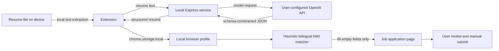

# Architecture & Privacy Data Flow

## Goal
Safest local-first architecture for resume upload, AI parsing, and autofill.

## Components

1. Extension popup (`src/popup.tsx`)
- Upload resume file and trigger parse.
- Display structured resume fields in Chinese labels.
- Trigger autofill for current page.

2. Resume extraction (`src/lib/resume-extract.ts`)
- PDF via `pdfjs-dist`.
- DOCX via `mammoth`.
- TXT via FileReader.

3. Extension parse client (`src/services/ai-parser.ts`)
- Calls local backend endpoint (default `http://127.0.0.1:8787/parse-resume`).
- Does not call OpenAI directly.
- Does not contain or read API keys.

4. Background (`src/background.ts`)
- Receives parse messages from popup.
- Calls parse client and persists parsed result.

5. Storage (`src/lib/storage.ts`)
- `resumeRecord`: raw text + structured parsed data.
- `parserSettings`: local backend URL + model.

6. Content script (`src/contents/autofill.ts`)
- Detects common fillable inputs/textareas.
- Maps CN/EN field names to structured resume keys.
- Autofills empty fields.

7. Local backend (`backend/server.mjs`)
- Exposes `/parse-resume` and `/health`.
- Reads `OPENAI_API_KEY` from environment variables only.
- Calls OpenAI and normalizes structured schema for Chinese job application fields.

## Data Flow

1. User uploads resume in extension popup.
2. Extension extracts text locally from PDF/DOCX/TXT.
3. Background posts text to local backend `/parse-resume`.
4. Local backend calls OpenAI with server-side `OPENAI_API_KEY`.
5. Backend returns structured JSON response.
6. Extension stores result in `chrome.storage.local` and renders it.
7. User triggers autofill and content script applies mapped values.
8. The extension stops after filling fields; the user reviews the values and manually submits the application.

## Trust boundaries

| Boundary | Data crossing it | Control in the MVP |
|---|---|---|
| Resume file → extension | Raw file and extracted text | File selection is user initiated; extraction happens in the extension |
| Extension → local backend | Extracted resume text | Backend listens on `127.0.0.1`; URL is explicit in settings |
| Local backend → model provider | Resume text | Key stays in server environment; user must review provider data policy |
| Structured resume → browser storage | Parsed personal data | Stored in `chrome.storage.local`; no cloud account or sync |
| Extension → application form | Selected field values | Empty fields only; user initiates filling and retains submission control |

## Security constraints for this MVP

- No OpenAI API key in extension frontend/background code.
- API key only exists in backend process env (`.env` on local machine).
- Extension only talks to local backend endpoint.
- Autofill never clicks the final submit button.
- Domain access does not imply verified compatibility; each site and component type requires dated regression evidence.
- This architecture has not completed a production security, privacy, or compliance review.
