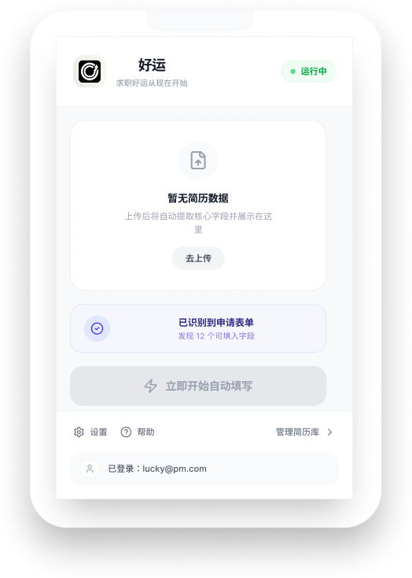
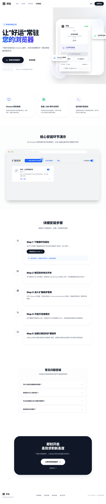

# 好运 AI Chrome Extension —— AI 驱动简历自动填写插件
AI-Powered Resume Auto-Fill Chrome Extension

🔗 产品原型 / Product Prototype：https://haoyun.figma.site  
🔗 前端管理平台 / Frontend Platform：https://github.com/zoezhuy/haoyun-app

**Product Screenshots 产品截图**

**插件弹窗 / Extension Popup**


**安装引导页 / Installation Landing Page**

---

**What is this? 这是什么**

好运 AI Chrome 插件是一款基于 LLM 的简历自动填写工具，通过 AI 字段智能匹配，实现在 LinkedIn / 智联招聘 / BOSS 直聘等平台一键自动填表，大幅降低求职者手动投递成本。

A Chrome extension that uses LLM-based field matching to auto-fill resume information across major job platforms (LinkedIn, Zhaopin, BOSS Zhipin), eliminating repetitive manual input for job seekers.

---

**Core Features 核心功能**

- 📄 支持上传 PDF / DOCX / TXT 格式简历
- 🤖 LLM 解析简历，提取结构化字段（姓名 / 学校 / 技能 / 经历等）
- ✍️ 自动识别招聘表单字段并精准填入
- 🔒 API Key 仅在本地后端读取，不暴露在前端代码中

---

**Tech Stack 技术栈**

TypeScript · Plasmo · OpenAI API · LLM · Prompt Engineering · Chrome Extension · Figma (UI Design) · Vibe Coding (Codex)

---

**MVP Flow MVP 流程**

1. 用户在 popup 上传简历（PDF / DOCX / TXT）
2. 插件本地提取简历文本
3. 发送至本地后端 `/parse-resume` 接口
4. 后端调用 OpenAI API，返回结构化 JSON
5. 插件将数据存入 `chrome.storage.local`
6. Content Script 自动识别表单字段并填入

---

**My Role 我的角色**

基于 Vibe Coding（Codex）独立完成产品定义、UI 设计与开发全流程  
Independently built with Vibe Coding (Codex) — from product definition to UI design and full development

- Prompt Engineering 设计与 LLM API 集成
- Chrome Extension 架构设计（popup / content script / background）
- Figma UI 设计与前端实现（TypeScript + Plasmo）
- 简历解析引擎与自动填表逻辑开发

---

**Local Setup 本地运行**
```bash
# 安装依赖
npm install

# 配置环境变量
cp .env.example .env
# 在 .env 中填入：OPENAI_API_KEY=your_key

# 启动本地后端
npm run dev:backend

# 启动插件开发服务
npm run dev
```

加载插件：打开 `chrome://extensions` → 开启开发者模式 → 点击「加载已解压的扩展程序」→ 选择 `build/chrome-mv3-dev`

---

**Related Repository 相关仓库**

Frontend Platform: https://github.com/zoezhuy/haoyun-app

---

**Contact 联系方式**

Email: zz3378@tc.columbia.edu  
GitHub: https://github.com/zoezhuy
