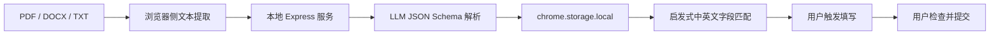
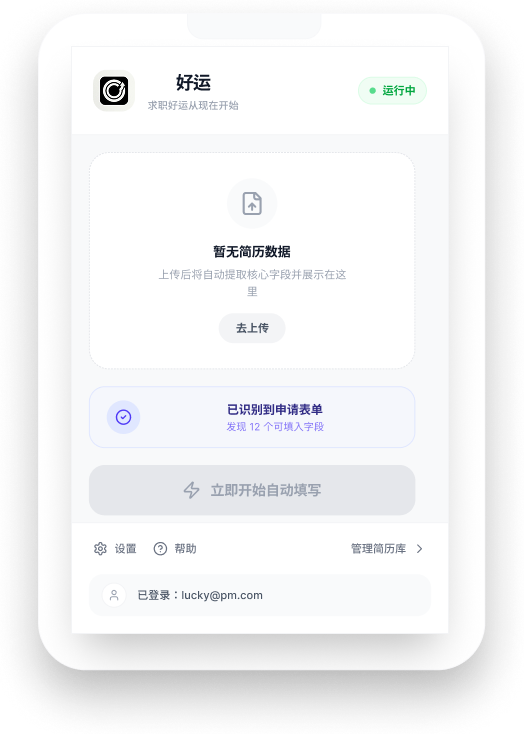
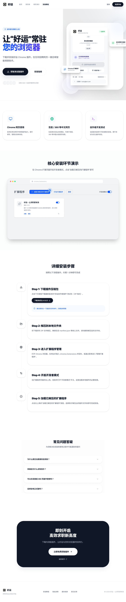

# 好运 AI｜本地优先的简历自动填写 Chrome 扩展

> 使用 LLM 将 PDF、DOCX 或 TXT 简历转换为结构化字段，再通过中英文启发式字段匹配帮助用户填写招聘网站表单。扩展只负责填写，最终检查与提交始终由用户完成。

[Web 作品集](https://zoezhuy.github.io/haoyun-app/) · [Figma 产品原型](https://haoyun.figma.site/) · [配套 Web 源码](https://github.com/zoezhuy/haoyun-app)

**一句话技术定位：LLM-based resume parsing + heuristic bilingual form-field matching.**

- **项目性质：** 个人作品集 / 本地 MVP
- **个人职责：** 问题定义、产品流程、Figma 原型、扩展架构、前后端实现与文档
- **核心技术：** Plasmo、Chrome Extension MV3、React、TypeScript、Express、OpenAI Responses API
- **实现边界：** LLM 用于简历结构化；网页字段识别使用启发式规则，不是 LLM 语义匹配

## 30 秒了解项目

国内求职者经常需要在不同招聘网站重复填写姓名、联系方式、教育、技能、实习和项目经历。平台字段名称、DOM 结构和组件实现并不统一，即使上传了简历，也可能仍需逐项输入。

好运建立一条“结构化一次、跨页面复用”的本地链路：

1. 用户主动上传 PDF、DOCX 或 TXT 简历；
2. 扩展在浏览器侧提取文本；
3. 只监听 `127.0.0.1` 的本地 Express 服务调用 OpenAI Responses API；
4. 模型按照 JSON Schema 返回统一简历结构；
5. 结构化结果保存在 `chrome.storage.local`；
6. 内容脚本结合 `name`、`id`、`label`、`placeholder`、`aria-label` 和邻近文本识别字段；
7. 用户触发填写、检查结果并自行提交。


```mermaid
flowchart LR
  A[PDF / DOCX / TXT] --> B[浏览器侧文本提取]
  B --> C[本地 Express 服务]
  C --> D[LLM JSON Schema 解析]
  D --> E[chrome.storage.local]
  E --> F[启发式中英文字段匹配]
  F --> G[用户触发填写]
  G --> H[用户检查并提交]
```

## 当前实现

| 能力 | 状态 | 说明 |
|---|---:|---|
| PDF / DOCX / TXT 文本提取 | ✅ MVP | 在扩展侧处理 |
| AI 简历结构化 | ✅ Local MVP | 本地服务调用模型并返回 Schema 约束 JSON |
| 浏览器本地数据保存 | ✅ | 使用 `chrome.storage.local` |
| 中英文字段识别 | ✅ MVP | 基于标签、属性与页面上下文的启发式规则 |
| 用户触发自动填写 | ✅ MVP | 不替用户点击最终提交 |
| 自定义下拉、日期和富文本组件 | 部分支持 | 仍需逐平台适配与回归测试 |
| 大规模平台兼容性验证 | 未完成 | 不声称对所有版本的招聘网站稳定兼容 |
| Chrome Web Store 发布 | 未完成 | 当前通过开发者模式本地加载 |

## 产品与技术决策

### LLM 解析简历，规则匹配页面字段

LLM 适合把格式不统一的简历文本转换为统一数据结构；网页填写则需要稳定、可调试并能适配 DOM 变化的逻辑。当前内容脚本使用透明的别名与页面特征规则，而不是把每个网页字段发送给模型。

### API Key 不进入扩展代码

浏览器扩展源代码可以被查看，因此 API Key 只由本地后端从环境变量读取。当前架构适合个人演示和本地使用，不是生产级云服务方案。

### 自动填写，但不自动投递

模型解析和字段匹配都可能出错。扩展默认只填写识别到的空白字段，用户需要检查每个字段并自行提交申请。

## 产品截图

### 扩展弹窗



### 安装与产品说明



## 平台兼容性记录

扩展清单中的域名权限只表示内容脚本可以在这些页面运行，不代表已经对每个平台的当前版本完成稳定兼容验证。

| 平台 / 测试环境 | 测试日期 | 文本框 | 原生下拉框 | 日期 / 自定义组件 | 已知问题 |
|---|---|---:|---:|---:|---|
| [仓库内合成测试页](./tests/autofill-test-page.html) | 2026-09-03 | 已验证 | 已验证 | 部分支持 | 不覆盖站点自定义组件和动态多步骤表单 |
| LinkedIn | 尚未形成可公开记录 | 待验证 | 待验证 | 待验证 | DOM 与流程会变化，不作稳定兼容承诺 |
| 智联招聘 | 尚未形成可公开记录 | 待验证 | 待验证 | 待验证 | 需要真实页面回归记录 |
| BOSS 直聘 | 尚未形成可公开记录 | 待验证 | 待验证 | 待验证 | 需要真实页面回归记录 |

字段别名的自动化用例位于 [`src/lib/field-matching.test.ts`](./src/lib/field-matching.test.ts)，测试中文/英文姓名、邮箱、电话、学校、专业、学历、毕业年份、职位、城市和作品集等映射，同时检查未知字段与公司名称不会被错误填写。

## 本地运行

环境要求：Node.js 20+。

```bash
git clone https://github.com/zoezhuy/haoyun-extension.git
cd haoyun-extension
npm install
cp .env.example .env
```

在 `.env` 中添加本地后端所需变量：

```text
OPENAI_API_KEY=your_key
BACKEND_PORT=8787
ALLOWED_EXTENSION_ORIGINS=chrome-extension://aaaaaaaaaaaaaaaaaaaaaaaaaaaaaaaa
```

`ALLOWED_EXTENSION_ORIGINS` 支持以逗号分隔多个扩展来源。本地加载未打包扩展时可以留空，此时后端只接受格式合法的 `chrome-extension://` 来源并拒绝普通网页；扩展 ID 固定后，建议填写精确来源。

分别启动本地解析服务与扩展开发环境：

```bash
npm run dev:backend
npm run dev
```

打开 `chrome://extensions`，启用开发者模式，选择“加载已解压的扩展程序”，然后加载 `build/chrome-mv3-dev`。

验证命令：

```bash
npm test
npm run typecheck
npm run build
```

## 项目结构

```text
src/
  popup.tsx                 # 上传、解析、保存和填写入口
  background.ts             # 扩展后台逻辑
  contents/autofill.ts      # 页面字段识别与填写
  lib/resume-extract.ts     # PDF / DOCX / TXT 文本提取
  lib/field-matching.ts     # 可独立测试的中英文字段映射规则
  lib/field-matching.test.ts# 字段识别自动化测试
  lib/storage.ts            # chrome.storage.local 封装
  services/ai-parser.ts     # 本地解析服务客户端
backend/
  cors-policy.mjs           # 本地服务的扩展来源白名单
  cors-policy.test.mjs      # 允许/拒绝来源自动化测试
  server.mjs                # OpenAI Responses API 与 JSON Schema 解析
tests/
  autofill-test-page.html   # 不含真实数据的合成表单测试页
```

更完整的数据流、信任边界和威胁控制见 [Architecture & Privacy Data Flow](./ARCHITECTURE.md)。

## 隐私与安全边界

- 简历文本会发送给用户自行配置的模型服务进行结构化处理；使用前应核对该服务的数据处理政策；
- API Key 不写入扩展前端，由本地后端环境变量读取；
- 本地后端拒绝普通网页来源，并可通过环境变量限定精确扩展 ID；
- 弹窗图标以内联 SVG 随扩展打包，不依赖远程设计资源；
- 结构化简历保存在当前浏览器的本地扩展存储中；
- 当前版本没有云账户、跨设备同步或生产级访问控制；
- 自动填写结果必须由用户复核；
- 不建议在未完成安全评审的情况下处理未经授权的第三方简历。

## 已知限制与下一阶段

1. 建立匿名测试表单集和可重复的兼容性记录；
2. 测量字段识别率、正确填写率和人工修正比例；
3. 加强日期、单选、多选、自定义下拉框、富文本和多步骤表单支持；
4. 增加填写前预览、字段级确认、撤销与错误诊断；
5. 增加字段映射和解析结果的自动化测试；
6. 完成隐私、安全和兼容性验证后再准备商店发布。

## Release

当前作品集基线版本为 `v0.1.0`：包含本地简历解析服务、浏览器本地存储、启发式中英文字段匹配、合成测试页和字段匹配自动化测试。该版本仍是开发者模式加载的本地 MVP，不是 Chrome Web Store 正式产品。

## License

[MIT](./LICENSE)

## Contact

Email: zz3378@tc.columbia.edu · GitHub: https://github.com/zoezhuy
